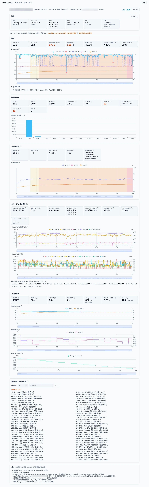
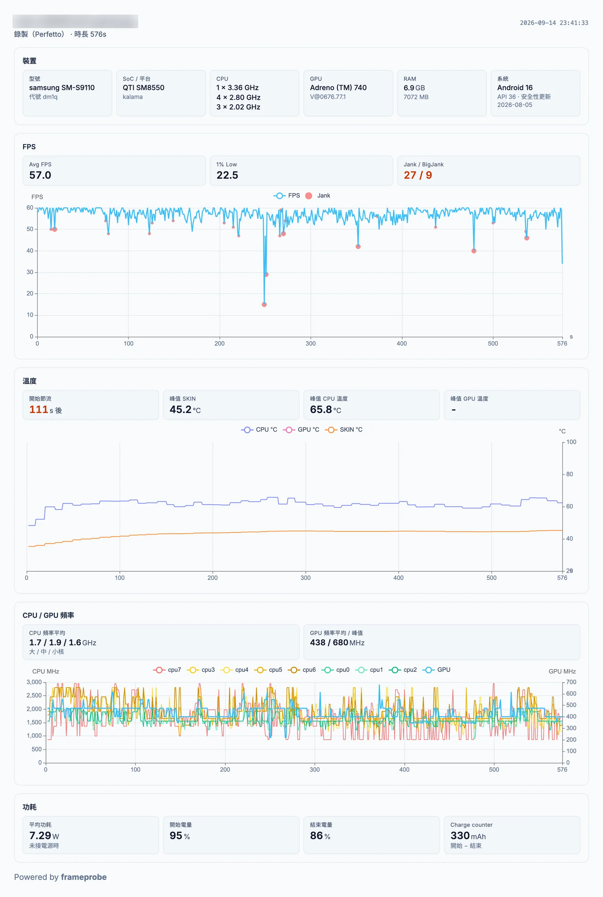

# frameprobe

Android 遊戲效能採集工具：幀率為主，附帶溫度、CPU／GPU、記憶體、功耗等資訊。

使用 Python CLI + FastAPI + Nuxt 製作，不需要 root 即可使用。

## 截圖





## 功能

- **裝置／診斷**
  - 裝置規格（SoC、CPU、GPU、RAM、螢幕更新率等）
  - 能力探測（timestats、Perfetto、thermal）
  - 即時／錄製模式是否可用
- **即時**
  - FPS／P90／P99／掉幀率
  - 幀間隔分布
  - Jank（近似）
  - 溫度與節流
  - CPU 使用率與各核心頻率
  - GPU 使用率／頻率／記憶體
  - 記憶體與 Memory Detail
  - 功耗與電池
  - 場景標籤
  - 門檻告警
  - 定時截圖
  - App 冷啟動時間
- **歷史**
  - 依裝置／套件／模式篩選
  - 移除 Session
- **報告**
  - Perfetto 逐幀分析（Jank／BigJank／Stutter／1% Low）
  - 溫度／CPU／GPU／功耗時間軸
  - 場景分段統計與超標區間
  - 多 Session 疊圖比較
  - CSV／JSON／圖片匯出

每個指標的資料來源與定義見 [`docs/metrics.md`](docs/metrics.md)。

## 安裝

需要 Python 3.11+、Node.js 以及 `adb`（需加入環境變數），並且裝置已開啟 USB 偵錯。

```bash
git clone https://github.com/wysalan/frameprobe && cd frameprobe
uv sync
cd web && npm install && npm run generate && cd ..    # 產出 web/.output/public
```

只需要 CLI、不需要儀表板的話，可以改用 `pipx install git+https://github.com/wysalan/frameprobe`。

有線／無線連接裝置的步驟見 [`docs/connecting.md`](docs/connecting.md)。

## 快速開始

Web 儀表板涵蓋所有 CLI 指令的功能：

```bash
uv run frameprobe serve            # http://127.0.0.1:8420
```

### CLI 指令

在原始碼目錄執行需在指令前加 `uv run`；使用 pipx 安裝可直接執行。

```bash
frameprobe devices                 # 列出裝置
frameprobe doctor                  # 能力探測。新機型上第一個要跑的指令
frameprobe watch  -p com.example.game --interval 1 --duration 60
frameprobe record -p com.example.game              # 隨錄隨停：Ctrl-C 結束並分析
frameprobe analyze <session_id>
frameprobe export <session_id> --format csv
frameprobe launch -p com.example.game --repeat 3     # 冷啟動時間
frameprobe serve --port 8420       # API + 儀表板
```

所有指令支援 `--json`。每個 Session 存在 `sessions/<session_id>/`，含彙總、逐筆取樣與所有 adb 原始輸出。

## 相容性

目標平台 Android 12 (API 31) ～ 17 (API 37)。

下表是實際用真機測過的機型；未列出的機型可以執行 `frameprobe doctor` 確認各項能力。

| 機型 | SoC／GPU | Android | `watch` | `record` | 溫度／節流 | GPU 使用率 | 功耗 | 備註 |
|---|---|---|:---:|:---:|:---:|:---:|:---:|---|
| Samsung Galaxy S23 (SM-S9110) | Snapdragon 8 Gen 2／Adreno 740 | 16 (API 36) | ✅ | ✅ | ✅ | ✅ | ✅ | 無 GPU 溫度 |
| Google Pixel 11 Pro | Tensor G6／PowerVR CXTP-48-1536 | 17 (API 37) | ✅ | ✅ | ✅ | ❌ | ✅ | GPU 可讀取頻率和記憶體 |

想回報新機型的測試結果，請依「回報問題」一節附上 `doctor` 輸出；確認可用後會補進這張表。

## 已知限制

- **不使用 `dumpsys SurfaceFlinger --latency`。** 它只回傳最近 127 幀且 layer name 格式不穩定；只有 `frameprobe diagnose` 會印出它供對照，並標註 `(unreliable)`。
- **純 SurfaceView 遊戲在 `record` 模式可能沒有 App 層級資料。** 此時自動改用顯示層級並在 summary 標明，jank 歸因不可用。
- **即時模式的 Jank 是近似值。** timestats 只有直方圖，只能以絕對門檻計數；要精確值用 `record`。

任何 fallback 都會在輸出中標明。完整清單與設計理由見 [`docs/limitations.md`](docs/limitations.md)。

## 回報問題

新機型上數字不對或解析失敗時，請附上 `sessions/<id>/raw/` 整個資料夾，以及 `frameprobe doctor --verbose --json` 的輸出。

**上傳前請先檢查並移除裝置序號**：`doctor` 的輸出與 `raw/` 內的檔案可能含有 adb 序號、無線連線的 IP 等資訊。

## 開發

```bash
uv sync
uv run pytest --cov=frameprobe     # 全部走 tests/fixtures/，不需要真機
uv run ruff check . && uv run mypy
cd web && npm run typecheck
```

前端開發時可 `cd web && npm run dev`（預設打 `http://127.0.0.1:8420` 的 API，可用 `NUXT_PUBLIC_API_BASE` 覆寫）。

開發規範見 [`CLAUDE.md`](CLAUDE.md)，fixture 來源見 [`tests/fixtures/README.md`](tests/fixtures/README.md)。

## 致謝與聲明

Jank 等部分指標採用 PerfDog（騰訊 WeTest）公開文件的定義以便對照；本專案為獨立實作，與騰訊／PerfDog 無任何關聯，詳見 [`docs/metrics.md`](docs/metrics.md#指標定義的參考來源)。

## 授權

[MIT](LICENSE)
